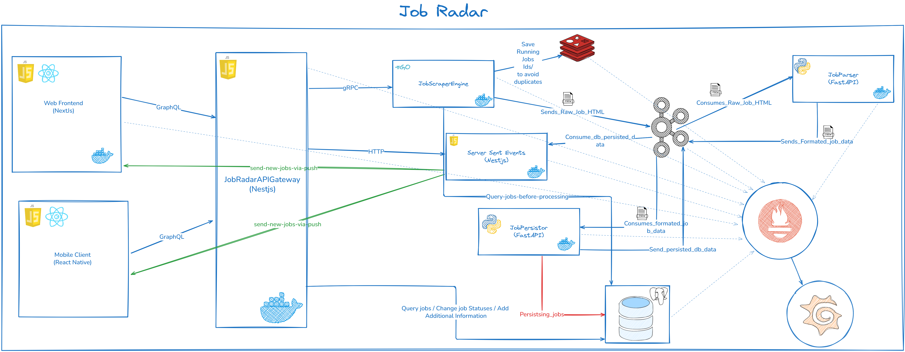

# 🕵️‍♂️ Job Radar — My Pet 🐶 Job Scraper



Job Radar is my little side project to scrape job postings from various sites and keep track of new opportunities without refreshing 50 tabs or signing up for sketchy alerts. It’s built with a mix of Go, Python, and Node.js because… why not? 😅

The diagram above will definitely change, from time to time. Lets see I might narrow the scope of the project 😅

## 🧠 What It Does

- Scrapes job listings from public job boards
- Parses and cleans the messy HTML into structured data
- Stores everything in a database
- Serves it up via a simple API (with real-time updates!)
- Has a frontend so I can actually _use_ it (and maybe you too?)

## 🛠️ Tech Stack (aka “the fun part”)

- **Go**: For the fast and reliable scraping engine
- **Python + FastAPI**: Handles parsing and saving jobs
- **Node.js + NestJS**: Powers the API gateway and real-time notifications
- **PostgreSQL**: Where all the job data lives
- **Redis**: Keeps things flowing smoothly between services
- **Next.js**: Simple frontend to browse jobs
- **React Native**: Maybe a mobile app, just for getting notifications using firebase 🤷
- **Docker**: Because I like my dev environment reproducible (and drama-free)

## 📦 Quick Start

Make sure you have Docker and Docker Compose installed.

```bash
git clone https://github.com/yourusername/job-radar.git
cd job-radar
docker-compose up --build
```

    ⚠️ Still very much a work in progress expect bugs, half-baked features, and occasional existential crises in the code.

🎯 Why?

Because I wanted to:

    Learn how to build a multi-language service system
    Get better at Go (it’s fun!)
    Stop missing cool job posts buried in noisy aggregators
    Have a project I can tinker with on weekends

🙌 Feel Free To…

    Fork it
    Poke around
    Suggest improvements
    Laugh at my over-engineering (I won’t take it personally)

Just don’t expect production-grade reliability… yet 😉

Making it with ☕ and curiosity by Usman
